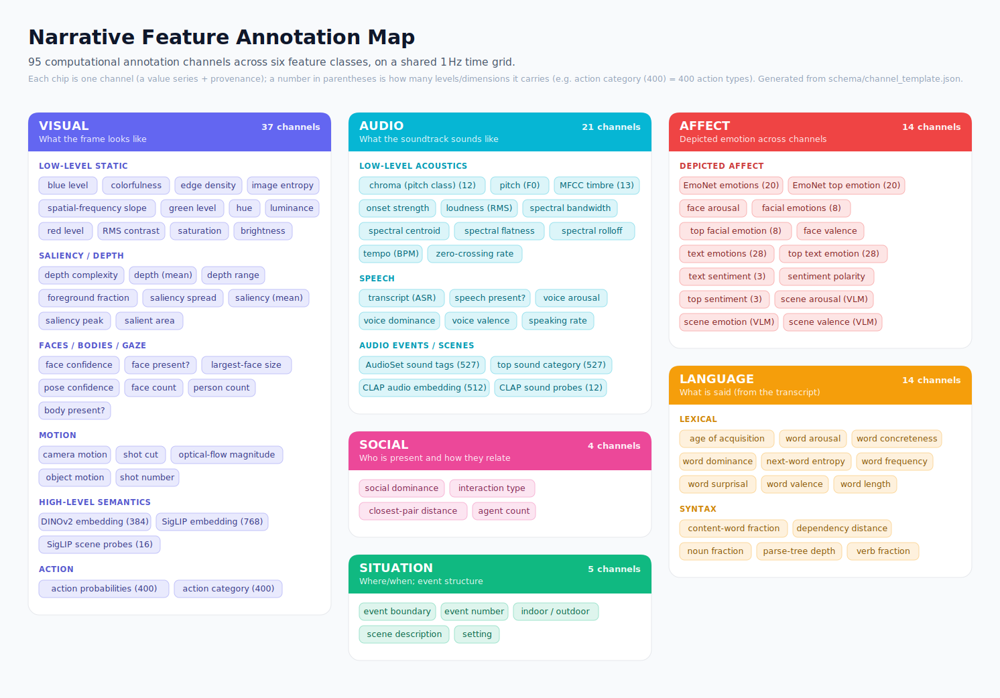

# Feature map

A visual map of **all 95 annotation channels and their hierarchical organization** — the
six feature classes, each grouped by subclass, with one chip per channel.



## Editable graphic

The map is a plain, flat **SVG** built for editing:
[`analysis/figures/feature_map.svg`](../analysis/figures/feature_map.svg).

- Open it in **PowerPoint**, **Illustrator**, **Inkscape**, or any browser. In PowerPoint,
  *Insert → Pictures*, then right-click → *Convert to Shape* to recolor, move, or relabel
  individual cards, chips, and text.
- It uses real text elements, per-card groups, and inline colors (no CSS or filters), so
  it survives import cleanly and recolors easily.
- Regenerate it whenever the channel set changes:
  ```bash
  python3 tools/build_feature_map.py     # reads schema/channel_template.json
  ```

## Feature summary table

Feature groups organized by class (row) and by level of abstraction (column). Numbers in
parentheses are the count of **variables** in that group — each scalar/flag counts as 1
and each vector counts as its dimensionality (so an embedding contributes many). "Level"
is the standard perception hierarchy: **low-level** = raw physical/perceptual signal,
**mid-level** = perceptual organization/structure, **high-level** = semantic/conceptual.

| Feature class | Low-level | Mid-level | High-level |
|---|---|---|---|
| **Visual** | image statistics (12); optical-flow motion (3); shot cuts (2) | saliency & depth (8); faces & bodies (7) | SigLIP semantics — embedding + scene probes (784); DINOv2 embedding (384); action recognition (400) |
| **Audio** | acoustics — loudness / pitch / timbre / MFCC / chroma (34) | speech presence & rate (2) | AudioSet sound tags (527); CLAP semantics — embedding + probes (524); vocal affect V/A/D (3) |
| **Language** | word frequency & length (2) | lexical norms — valence / arousal / dominance, concreteness, AoA (5); syntactic complexity (5) | word surprisal & next-word entropy (2) |
| **Social** | — | agent count & closest-pair distance (2) | interaction type & social dominance (2) |
| **Situation** | — | — | scene description / setting / indoor–outdoor (3); event structure — boundaries & event id (2) |
| **Affect** | — | facial affect — 8 expressions + valence + arousal (10) | EmoNet image emotion (20); text emotion & sentiment (32); VLM depicted emotion (3) |

> A one-page Word version of this table (for import into Google Docs) is at
> [`docs/feature_summary_table.docx`](feature_summary_table.docx), regenerated by
> `python3 tools/build_feature_summary.py`.

## The major feature types

What each model in the pipeline is, what it outputs, why it is useful (with an eye to
fMRI encoding / brain–feature modeling), and the canonical reference. Counts in
parentheses match the chips above. Reference links go to the public paper; local PDF
copies live in `PDFs/` (Dropbox-only).

### Visual — what the frame looks like

- **Low-level image statistics (12)** — Classic per-frame pixel/color measures computed with
  [scikit-image](https://doi.org/10.7717/peerj.453): luminance, RMS contrast, mean red/
  green/blue and hue/saturation/brightness, edge density, image entropy, the slope of the
  spatial-frequency (Fourier) power spectrum, and perceptual
  [colorfulness](https://infoscience.epfl.ch/record/33994) (Hasler & Süsstrunk 2003).
  These are the cheapest, most reproducible visual regressors and the standard low-level
  controls in vision/fMRI work — early visual cortex (V1–V2) tracks luminance, contrast,
  and spatial-frequency energy closely, so they are essential nuisance/target regressors
  before attributing signal to higher-level features.

- **SigLIP 2 embedding (768) + scene probes (16)** — Google's
  [SigLIP 2](https://arxiv.org/abs/2502.14786) is a contrastive vision–language model (a
  Vision Transformer trained to align images with text). It converts each frame into a
  768-dimensional semantic embedding, and by scoring the frame against short text prompts
  it also yields 16 interpretable scene-probe values (e.g. indoor/outdoor, nature, faces,
  text). The embedding is a strong general-purpose semantic space for encoding/RSA models
  of higher visual and category-selective cortex; the probes give human-readable scene
  descriptors.

- **DINOv2 embedding (384)** — Meta AI's [DINOv2](https://arxiv.org/abs/2304.07193) is a
  self-supervised Vision Transformer that turns an image into general-purpose visual
  features **without** using any labels or text. Its 384-d global embedding captures
  objects, parts, texture, and layout, and is a leading backbone for representational-
  similarity analysis, linear-probe decoding, and voxelwise encoding of ventral-stream
  responses — complementary to SigLIP because it is label-free (vision-only).

- **Action recognition (400)** — [VideoMAE](https://arxiv.org/abs/2203.12602) (masked-
  autoencoder video Transformer, fine-tuned on Kinetics-400) reads a short clip and
  outputs a probability over **400 human-action categories** (e.g. running, dancing,
  cooking, shaking hands, playing guitar). The pipeline stores the full 400-value
  probability vector plus the single top action label per second — a semantic
  "what are people doing" regressor for action-observation and social/motor brain systems.

- **Motion — optical flow (3)** — [RAFT](https://arxiv.org/abs/2003.12039) estimates dense
  per-pixel motion between consecutive frames. From it the pipeline derives overall
  optical-flow magnitude, a camera-motion estimate, and residual (object) motion. Low-
  level motion energy is a classic driver of MT/MST and dorsal-stream responses and a
  standard motion regressor in naturalistic fMRI.

- **Shot cuts & shot index (2)** — A histogram-based cut detector (a lightweight stand-in for
  [TransNetV2](https://arxiv.org/abs/2008.04838)) flags edit boundaries and numbers the
  shots. Cuts are strong low-level visual-transient events and useful for modeling
  attention/event-onset responses.

- **Faces & bodies (7)** — [MTCNN](https://arxiv.org/abs/1604.02878) detects faces (count,
  detection confidence, largest-face size, face-present flag) and
  [Keypoint R-CNN](https://arxiv.org/abs/1703.06870) (from the Mask R-CNN family) detects
  human body pose (person count, pose confidence, body-present flag). Face presence/size
  is a primary regressor for face-selective cortex (FFA/OFA/STS); body/person presence
  drives EBA and the person-perception network.

- **Saliency & depth (8)** — A spectral-residual [saliency](https://ieeexplore.ieee.org/document/4270292)
  model (Hou & Zhang 2007; stand-in for a deep video-saliency net) gives where the eye is
  likely drawn (mean/peak saliency, spread, salient-area fraction), and
  [Depth-Anything-V2](https://arxiv.org/abs/2406.09414) gives monocular depth (mean depth,
  depth range, depth complexity, foreground fraction). Saliency proxies bottom-up
  attention; depth/near-far structure relates to scene-geometry coding (PPA/OPA).

### Audio — what the soundtrack sounds like

- **Low-level acoustics (34)** — [librosa](https://doi.org/10.25080/Majora-7b98e3ed-003)
  computes loudness (RMS), spectral shape (centroid, bandwidth, rolloff, flatness),
  zero-crossing rate, onset strength, a 13-value **MFCC** timbre vector, and a 12-value
  **chroma** (musical pitch-class) vector; pitch/F0 uses
  [pYIN](https://www.eecs.qmul.ac.uk/~simond/pub/2014/MauchDixon-PYIN-ICASSP2014.pdf) and
  tempo uses [dynamic-programming beat tracking](https://www.music.columbia.edu/~dpwe/pubs/Ellis07-beattrack.pdf)
  (Ellis 2007). These are the standard acoustic regressors for auditory-cortex encoding
  (loudness/spectral envelope track Heschl's-gyrus responses).

- **AudioSet sound tags (527)** — the [Audio Spectrogram Transformer](https://arxiv.org/abs/2104.01778)
  (AST) classifies each ~1 s window into **527 sound-event categories** from Google's
  AudioSet ontology (speech, music, laughter, vehicles, animals, gunshots, applause,
  weather, …). The pipeline stores the full 527-value tag vector plus the top tag — a rich
  semantic description of the auditory scene for modeling category-selective auditory and
  associative regions.

- **CLAP audio embedding (512) + sound probes (12)** —
  [CLAP](https://arxiv.org/abs/2211.06687) is a contrastive language–audio model (the audio
  analogue of CLIP): it embeds each audio window into a 512-d space aligned with text, so
  arbitrary text prompts ("a crowd cheering", "tense music") can be scored against it. The
  pipeline keeps the 512-d embedding and 12 interpretable sound probes. The embedding is a
  general auditory-semantic feature space for encoding models.

- **Speech (5)** — [faster-whisper](https://arxiv.org/abs/2212.04356) (Whisper) transcribes
  speech and yields a speech-present flag and speaking rate (words/s);
  [audEERING wav2vec2](https://arxiv.org/abs/2203.07378) reads **vocal affect** directly
  from the voice as continuous valence, arousal, and dominance. Speech presence and
  speaking rate are core language-network regressors; vocal affect targets prosody/emotion
  circuits (e.g. voice-sensitive STS, amygdala).

### Language — what is said (from the transcript)

- **Lexical semantic norms (5)** — per word, human-rated norms are looked up: emotional
  [valence, arousal, dominance](https://doi.org/10.3758/s13428-012-0314-x) (Warriner 2013),
  [concreteness](https://doi.org/10.3758/s13428-013-0403-5) (Brysbaert 2014), and
  [age of acquisition](https://doi.org/10.3758/s13428-012-0210-4) (Kuperman 2012). These
  are the classic word-property regressors for language and semantic fMRI.

- **Word frequency & length (2)** — [wordfreq](https://doi.org/10.5281/zenodo.7199437) gives
  each word's log frequency (Zipf scale) and its length. Frequency is a robust predictor
  of lexical-access difficulty and reading/listening time.

- **Surprisal & next-word entropy (2)** — [GPT-2](https://cdn.openai.com/better-language-models/language_models_are_unsupervised_multitask_learners.pdf)
  provides each word's **surprisal** (how unexpected it was, in bits) and the entropy of
  the model's next-word prediction. Word-by-word surprisal from language models is one of
  the most reliable predictors of language-network and N400-type responses in
  naturalistic-comprehension fMRI/MEG.

- **Syntax (5)** — [spaCy](https://spacy.io) parses each utterance for content-word fraction,
  noun/verb fraction, parse-tree depth, and mean dependency distance — proxies for
  syntactic complexity and processing load.

- **LLM language embeddings (5120)** — a dense, contextual representation of *what is said*,
  mirroring SigLIP/CLAP for the other modalities. [Qwen3-Embedding](https://github.com/QwenLM/Qwen3-Embedding)
  (Alibaba, 2025) gives a 1024-d sentence embedding per utterance, and
  [Llama-3.1-8B](https://arxiv.org/abs/2407.21783) supplies 4096-d autoregressive hidden
  states — the standard feature for fMRI/MEG language-encoding models. Aligned to whisper
  word timings and resampled to 1 Hz.

- **Semantic & narrative surprise (6)** — interpretable scalars derived from the embeddings
  at rising levels: **semantic coherence / drift / novelty / surprise** (how the meaning of
  each line relates to what came before, from the Qwen3 embeddings) and **narrative
  expectedness / surprise** (how predictable each line is given the story so far, rated by
  Llama-3.1-8B-Instruct). Together with GPT-2 word surprisal and spaCy syntax, these span
  lexical → semantic → discourse/narrative prediction error.

### Social — who is present and how they relate

- **Social relations (4)** — derived from the video by the [Qwen2.5-VL](https://arxiv.org/abs/2502.13923)
  vision-language model (interaction type, social dominance) plus face/pose detectors
  ([MTCNN](https://arxiv.org/abs/1604.02878) agent count;
  [Keypoint R-CNN](https://arxiv.org/abs/1703.06870) closest-pair distance). These target
  the social-perception network (STS, TPJ, mentalizing regions) that tracks the number of
  agents, their proximity, and the type of interaction.

### Situation — where/when; event structure

- **Scene & setting (3)** — the [Qwen2.5-VL](https://arxiv.org/abs/2502.13923) VLM produces a
  free-text scene description, an indoor/outdoor label, and a coarse setting label per
  second — high-level context for scene/place-selective cortex.
- **Event boundaries (2)** — [GSBS](https://doi.org/10.1016/j.neuroimage.2021.118085)
  (Greedy State Boundary Search; Geerligs 2021) segments the annotation time series into
  discrete "events," emitting boundary events and a running event number. This directly
  operationalizes event-segmentation theory and models the boundary responses seen in
  hippocampus and default-mode regions during naturalistic viewing.

### Affect — depicted emotion across channels

Emotion is read from several independent channels/modalities so it can be cross-validated
(facial, textual, and holistic-scene here; vocal affect lives under Audio → Speech):

- **EmoNet — image emotion (20)** — [EmoNet](https://www.science.org/doi/10.1126/sciadv.aaw4358)
  (Kragel et al. 2019, *Science Advances*) is an AlexNet-based CNN that maps a video frame
  onto **20 emotion categories** (e.g. amusement, awe, fear, sexual desire, horror, joy,
  sadness). It was trained to predict the emotion evoked by images and validated against
  human ratings and brain responses, making it a purpose-built regressor for visual
  emotion-category coding in the brain.

- **Facial affect (10: 8 expressions + valence + arousal)** —
  [HSEmotion](https://arxiv.org/abs/2403.11590) (Savchenko) reads faces detected in the
  video and classifies expression into **8 categories** (anger, contempt, disgust, fear,
  happiness, neutral, sadness, surprise) plus continuous facial valence and arousal —
  targeting emotion read-out from faces (amygdala, STS, face network).

- **Text emotion & sentiment (28 + 3)** — from the transcript,
  [GoEmotions](https://arxiv.org/abs/2005.00547) RoBERTa scores **28 fine-grained emotions**
  (admiration, gratitude, grief, …) and [CardiffNLP](https://arxiv.org/abs/2202.03829)
  RoBERTa scores **3-way sentiment** (negative/neutral/positive) with a continuous polarity.
  These capture the emotional content of what is said.

- **VLM depicted emotion (3)** — [Qwen2.5-VL](https://arxiv.org/abs/2502.13923) also judges the
  overall depicted emotion, valence, and arousal of the scene as a holistic cross-check on
  the specialized channels.

## Related

- The **designed semantic hierarchy** behind these channels (the taxonomy the pipeline is
  organized around): [feature hierarchy](scoping_review/01_hierarchy.md).
- What each pass actually computes: [pipeline status](design/PHASE2_STATUS.md).
- The full per-model survey (all surveyed tools, with references): the
  [scoping review](scoping_review/00_overview.md) sections.
- The on-disk layout of these channels in each `.h5`: [annotation format](design/ANNOTATION_FORMAT.md).
