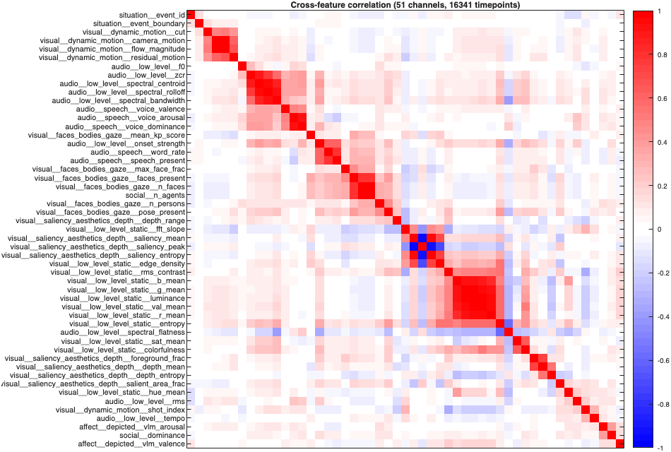
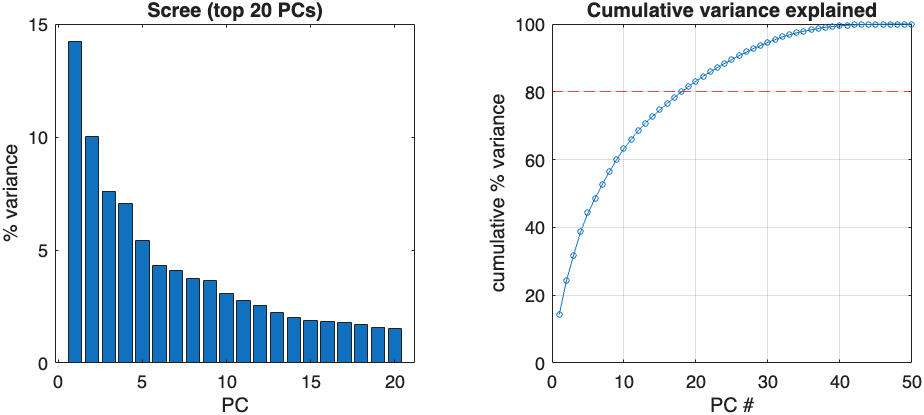
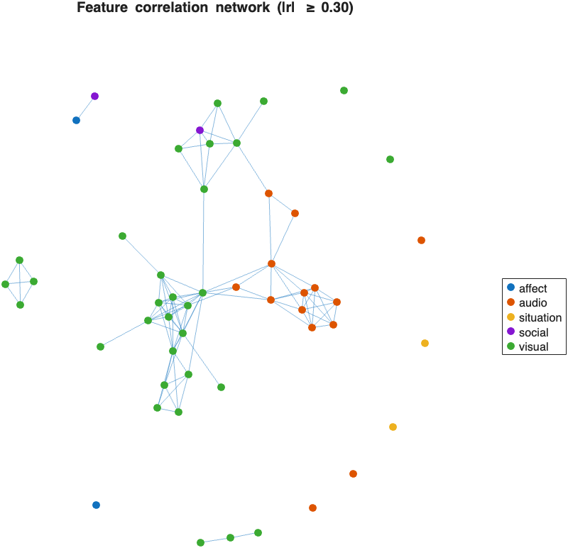
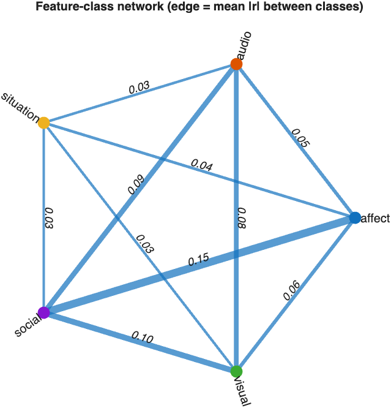
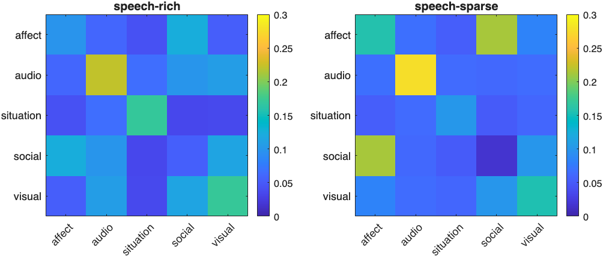
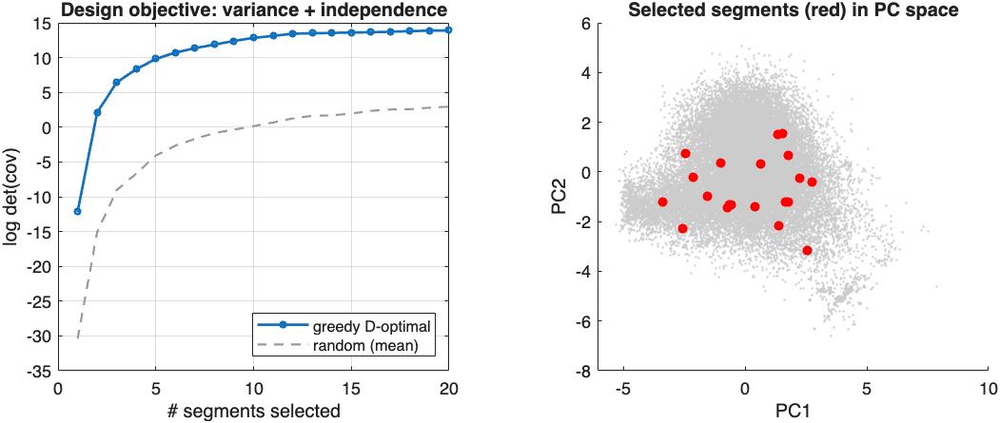

# Computational Annotation of Movies and Stories: Models, a Second-by-Second Annotation Pipeline, and the Structure of Naturalistic Feature Spaces

*Draft review paper — Narrative Feature Extraction project. Figures referenced here are
generated by `matlab/analyzeCorpus.m` and `matlab/selectStimulusSet.m` into
`analysis/figures/`.*

## Abstract

Naturalistic stimuli — movies and spoken stories — are increasingly used to study
perception, language, social cognition, and emotion under ecologically rich
conditions. Their analytic value depends on dense, well-organized annotations of what
the stimulus contains at each moment. We describe an infrastructure that converts an
arbitrary movie or audio story into **second-by-second computational annotations**
spanning visual, auditory, linguistic, social, situational, and affective features,
produced by a curated set of 23 best-in-class (or best-available-locally) models. The
annotations are emitted in a single constant-shape, hierarchical format that loads
natively into MATLAB, with explicit nulls where a feature does not apply. We annotate an
**83-stimulus, ~7.8-hour corpus** spanning three modalities — audiovisual clips and films,
spoken-story audio (the open *Narratives* collection), and a text story — and analyze the
structure of the resulting feature space. The annotations are **highly multidimensional**
(12 principal components explain 80% of the variance in the modality-shared audio/language
channels; 18 in the audiovisual subset that adds the visual/social/situational/affective channels),
organized into interpretable redundancy blocks. Cross-class couplings are **modest** — the
strongest is affect↔social (mean |r| ≈ 0.15), followed by visual↔social and audio↔social (≈ 0.11) —
and roughly stable across content; language-class scalar features are defined only by dialogue not
present throughout, so that class is under-represented in the corpus-wide analysis, while the
spoken stories make the corpus richly language-annotated.
Finally, we use the annotation space to drive an experimental-design tool that selects
high-variance, low-redundancy stimulus segments. All
tools, derivatives, and an interactive viewer and web search interface are released with the
project.

## 1. Introduction

A central methodological problem in naturalistic neuroimaging and cognitive science is
**annotation**: to relate brain or behavioral responses to a movie or story, one needs
a time-resolved description of the stimulus across many feature classes simultaneously.
Hand annotation is slow, low-dimensional, and hard to standardize. Recent advances in
computer vision, audio understanding, speech recognition, and language and
vision-language models make it feasible to annotate naturalistic stimuli
automatically across a wide range of features, from low-level image statistics to
high-level social and situational content.

This project builds that infrastructure in four phases: (1) a scoping review of
computational tools per feature class (`docs/scoping_review/`); (2) a pipeline of
selected models producing a hierarchical, second-by-second annotation; (3) annotation
of a corpus; and (4) analysis of the annotation structure plus dissemination tools.
This paper documents the models and algorithms, the annotation format, and the
empirical structure of the annotations over the corpus.

## 2. Feature taxonomy and annotation hierarchy

Annotations are organized into a semantic hierarchy of six top-level classes, each with
subclasses (full tree: `docs/scoping_review/01_hierarchy.md`):

- **Visual** — low-level static (luminance, contrast, color, edges, spatial-frequency
  slope, entropy), high-level static (object/scene semantics), faces/bodies/gaze,
  dynamic motion, action, and saliency/depth.
- **Audio** — low-level acoustics (loudness, spectral shape, MFCC, chroma, pitch,
  onset, tempo), high-level audio events/scenes, and speech.
- **Language** — lexical/word-level, syntactic/grammatical, and high-level semantic
  features computed from the transcript.
- **Social** — agents present, interaction type, dominance/affiliation, proximity.
- **Situation** — setting, event boundaries, and situational dimensions.
- **Affect** — depicted (expressed) and elicited emotion across face, voice, text, and
  fusion.

Each leaf of the hierarchy is a **channel** — a value series sampled on a common time
grid (default 1 Hz). This taxonomy is the organizing backbone of both the scoping
review and the on-disk format.

## 3. Models and algorithms

The pipeline implements 24 extractors. For each we name the model actually deployed and,
where a lighter local stand-in was used, the best-in-class model it substitutes for
(production targets). Local-first deployment runs on a single Apple-Silicon GPU (Metal/
MPS) or CPU; a small number of high-level reasoning features can optionally be routed to
hosted large models.

### 3.1 Visual

- **Low-level static** (scikit-image / NumPy): per-frame luminance, RMS contrast, RGB/
  HSV color means, Hasler–Süsstrunk colorfulness, Canny edge density, Shannon entropy,
  and the slope of the radially averaged Fourier power spectrum.
- **High-level semantics**: **SigLIP 2** (sigmoid language–image pretraining) provides a
  per-frame image embedding and zero-shot probe scores over a text prompt set;
  **DINOv2** provides a label-free self-supervised embedding. These are kept as distinct
  representations (interpretable text-probed vs. representational-similarity).
- **Motion**: dense optical flow via **RAFT** (substituting SEA-RAFT) → flow magnitude,
  a global-median "camera motion" term, and a residual "object motion" term.
- **Depth**: **Depth-Anything-V2** → per-frame relative-depth statistics (mean, range,
  foreground fraction, depth entropy).
- **Action**: **VideoMAE** over sliding 16-frame clips → Kinetics-400 action posteriors
  and the top action label.
- **Faces**: **MTCNN** (facenet-pytorch; substituting InsightFace/OpenFace) → face count,
  presence, largest-face size, detection confidence; also feeds Social (agents present).
- **Pose**: torchvision **Keypoint R-CNN** (substituting MMPose RTMPose) → person count,
  mean keypoint confidence, and nearest-pair distance (a proximity proxy feeding Social).
- **Saliency**: spectral-residual saliency (substituting ViNet) → saliency mean/peak/
  entropy and salient-area fraction.
- **Shots**: a color-histogram cut detector (substituting TransNetV2 + PySceneDetect) →
  cut events and a running shot index, feeding Visual, Situation, and Action.

### 3.2 Audio and speech

- **Low-level acoustics** (librosa): RMS, spectral centroid/bandwidth/rolloff/flatness,
  zero-crossing rate, onset strength, pitch (pYIN), tempo, MFCC and chroma vectors.
- **Audio events/scenes**: **AST** (Audio Spectrogram Transformer; substituting BEATs)
  → AudioSet-527 tag posteriors and top tag.
- **Open-vocabulary audio**: **CLAP** → an audio embedding and zero-shot scores over a
  prompt set (speech / music / noise / laughter / …), kept distinct from AST's fixed
  taxonomy.
- **Speech (the transcript hub)**: **faster-whisper** transcribes with word- and
  segment-level timestamps. The resulting transcript is attached to the pipeline and
  consumed by all language, social, situational, and text-affect passes — speech-present,
  word-rate, and per-bin text are emitted directly.
- **Vocal affect**: the **audEERING wav2vec2** dimensional model → continuous voice
  arousal / dominance / valence (a *depicted* affect stream).

### 3.3 Language (from the transcript)

- **Lexical** (spaCy + wordfreq + optional psycholinguistic norms): per-word Zipf
  frequency, length, and — when the standard norm tables are supplied — valence,
  arousal, dominance, concreteness, and age-of-acquisition.
- **Syntax** (spaCy): per-utterance dependency-tree depth, mean dependency distance,
  content-word fraction, and noun/verb fractions.
- **Surprisal**: a **GPT-2** language model → per-segment surprisal and entropy (bits) —
  the standard predictability regressors.

### 3.4 Social, situational, and affective; event structure

- **Consolidated reasoning**: a single **Qwen2.5-VL** vision-language pass per time
  window emits a structured JSON that populates Social (interaction type, dominance),
  Situation (setting, indoor/outdoor, scene description), and Affect (depicted emotion,
  valence, arousal) at once — replacing several separate high-level models with one pass.
- **Text emotion**: **RoBERTa-GoEmotions** → 28-way emotion scores over the transcript,
  a depicted (content) affect stream distinct from voice/face/elicited affect.
- **Text sentiment**: **CardiffNLP twitter-roberta** (trained on ~124M tweets + TweetEval)
  → negative/neutral/positive posteriors and a signed polarity scalar over the transcript,
  a coarse *valence-polarity* complement to the fine-grained GoEmotions categories.
- **Image emotion (EmoNet)**: the **Kragel et al. (2019)** AlexNet-based model → a 20-way
  distribution over normative emotion categories for each whole frame ("emotion schemas
  embedded in the visual system"), a validated image-level depicted-affect signal.
- **Facial affect**: **HSEmotion** (EfficientNet trained on AffectNet, state-of-the-art
  facial-expression recognition) reads each MTCNN-detected face → eight expression
  posteriors plus continuous facial valence and arousal, averaged over faces per frame.
- **Event segmentation**: **GSBS** (Greedy State Boundary Search) runs as a *post-pass*
  over the assembled feature matrix, yielding data-driven event states and boundaries.

Affect is thus captured from five complementary sources — image (EmoNet), face (HSEmotion),
voice (audEERING), text emotion (GoEmotions) and text sentiment (CardiffNLP), plus the
scene-level VLM stream. A deliberate design principle is to keep complementary signals
separate rather than collapse them — e.g., interpretable vs. representational embeddings,
fixed-taxonomy vs. open-vocabulary audio tagging, and **depicted vs. elicited** affect.

## 4. Pipeline and output format

Media are decoded with PyAV (frames + audio) without a system ffmpeg dependency. Each
extractor produces channels at its native rate; a common-grid resampler maps every
channel onto the shared 1 Hz grid (center-referenced bins) with a per-channel reduction
rule. Output is a single **HDF5** file per stimulus with hierarchical groups mirroring
the taxonomy, per-channel metadata (model, version, native rate, units, resample op), a
reserved `/human/` group for later human annotation, and a readable JSON sidecar
manifest (full spec: `docs/design/ANNOTATION_FORMAT.md`).

A central feature is the **constant-shape contract**: an auto-generated channel template
ensures every stimulus yields the *same* channel set; features that do not apply to a
stimulus (e.g., visual features for an audio-only story, or a pass that was not run) are
present with `applicable=false` and all-`NaN`. This makes the corpus directly stackable
into rectangular matrices for analysis, and distinguishes *not-applicable* from
*not-measured* from *measured-zero*. A lightweight MATLAB reader loads any annotation
into structs and timetables.

## 5. Corpus

The analyzed corpus comprises **105 stimuli totaling ~588.9 minutes (~7.8 hours)** across
three modalities: 49 short **audiovisual** clips from a naturalistic-fMRI stimulus set, 4
short films (3 Creative-Commons Blender open films — Big Buck Bunny, Sintel, Tears of Steel —
and *Kung Fury*), **29 spoken-story audio** stimuli (~5.3 h) from the openly-released
*Narratives* collection (Nastase et al., 2021; OpenNeuro ds002345), and 1 pure-text sample
story — i.e. **75 audiovisual, 29 audio-only, and 1 text-only** stimuli. Every stimulus was
annotated under the same constant 103-channel template; classes that do not apply to a modality
(e.g. visual features for an audio story) are present as `applicable=false` null skeletons.
Stacked, the corpus yields **35,331 one-second timepoints**, demonstrating that stimuli of very
different modalities share one common analysis format.

Because the corpus is modality-mixed and now dominated (in timepoints) by audio stories, the
channels populated *across all stimuli* are the audio, speech, and language features; the
visual/social/situational channels are — correctly — undefined for the audio and text stimuli.
Corpus-wide analysis of the shared scalar channels therefore reflects this audio/language core
(**26 channels** survive a ≤40%-missing filter), while modality-specific structure is analyzed
on the **75-stimulus audiovisual subset** (below; 51 channels). Adding the spoken stories also
transformed the corpus from dialogue-light to language-rich: word-level surprisal is defined in
**91%** of story timepoints, versus sparse coverage in the audiovisual clips.

The vision-language reasoning pass was run across the **entire audiovisual subset**, so its
depicted-affect, social-interaction, and situational scalars are populated throughout that
subset and enter the cross-class analysis below. Affect is in fact the most richly *sourced*
class — image-level (EmoNet), face-level (HSEmotion), voice (audEERING), text emotion and
sentiment, and the scene-level VLM stream — but the scalar cross-class analysis below is
dominated by the dense VLM affect scalars: the face-level valence/arousal and dialogue-level
sentiment are only defined when a face or speech is present, so across the intermittently-peopled,
dialogue-light audiovisual clips they exceed the ≤40%-missing filter and drop out of the
aggregate matrix (they remain fully available per-timepoint as fMRI regressors, and EmoNet's dense
20-way image-emotion distribution is retained as a feature vector rather than a single scalar). One
class remains under-represented in the scalar analysis for the same reason: **language** is richly
populated by the audio stories but sparse in the dialogue-light audiovisual clips, so it survives
the missing-data filter in the full corpus but not in the audiovisual subset. Interpret the
couplings below accordingly.

## 6. The structure of the annotation space

### 6.1 Redundancy structure

The clustered cross-feature correlation matrix (**Fig. 1**, audiovisual subset) shows
interpretable redundancy blocks — for example, the brightness channels (luminance, R/G/B and
value means) are nearly collinear, and groups of spectral audio descriptors co-vary. These
blocks are expected and motivate keeping a *parsimonious* core set plus complementary extras
(cf. `docs/scoping_review/08_redundancy.md`).

### 6.2 Dimensionality

The annotation set is **highly multidimensional**. Across the full 83-stimulus corpus, the 26
audio/language channels shared by all modalities require **12 principal components to reach 80%**
of the variance (PC1–5 ≈ 50%). On the 75-stimulus **audiovisual subset** (**Fig. 2**),
which adds the visual/social/situational/affective channels, 51 channels require **18 PCs to reach 80%**.
Either way, naturalistic feature space has many semi-independent axes to sample — encouraging for
stimulus design.

### 6.3 Cross-feature and cross-class networks

On the audiovisual subset, thresholding the correlation matrix (|r| ≥ 0.30) gives a feature
network whose nodes cluster by class (**Fig. 3**). After excluding categorical class-code
channels (which must not be treated as magnitudes), the classes with valid scalar features here
are **affect, visual, audio, social, and situation** (language drops out for the reason in
§5). Aggregating to the class level (mean |r| between classes; **Fig. 4**), the cross-class
couplings are **modest**: the strongest is **affect ↔ social** (0.15) — depicted emotion tracks
the social-interaction structure — followed by **visual ↔ social** and **audio ↔ social** (both
0.11), then audio↔visual (0.07). Affect is otherwise weakly coupled to visual, audio, and
situational features (|r| ≤ 0.06), and the situational features are nearly independent of the
others (|r| ≤ 0.04). In the *full* corpus the audio stories carry no visual/social/affective
channels, so the corpus-wide network is dominated by the audio↔language block — a direct
consequence of the modality mix. (The affect↔social value here comes from the vision-language
reasoning pass run across the audiovisual subset; an earlier draft reported a larger 0.26, which
a code review found was inflated by treating the `text_emotion_top` *class-index* channel as a
numeric feature — the 0.15 above uses only the model's continuous valence/arousal scalars.)

### 6.4 Couplings are modest and roughly stable across content

Splitting the audiovisual subset by speech density (per-stimulus mean word rate, median split;
**Fig. 5**) shows that the valid cross-class couplings are **small and fairly stable** across
content — e.g. visual↔social is 0.13 in speech-rich vs 0.13 in speech-sparse stimuli. The
annotation classes are thus largely non-redundant with one another regardless of stimulus type,
which is favourable for stimulus design (independent axes to sample). Complementarily,
adding the 29 spoken stories makes the corpus richly language-annotated (word-level surprisal
defined in 91% of story timepoints) where the audiovisual clips were dialogue-light.

## 7. Experimental design from the annotation space

A direct application is principled **stimulus selection**. We split every stimulus into
fixed-length candidate segments and greedily select a subset that maximizes the
log-determinant of the covariance of the concatenated annotation time series projected
onto the leading principal components. Maximizing log det(cov) simultaneously rewards
high variance across the major feature dimensions and statistical independence (low
cross-correlation) among the feature time series — a D-optimal design over the annotation
space. Candidate segments dominated by missing (mean-imputed) data are excluded, so a segment
cannot win the objective *because* its features are undefined. Over the full 83-stimulus corpus,
selecting 20 ten-second segments yields a log det(cov) of **12.8 versus 2.5 for random selection**
(**Fig. 6**) — about 5× the generalized variance — while drawing segments from 16 distinct
stimuli across modalities. This tool turns the corpus into an optimized stimulus set for an
experiment targeting the annotation feature space.

## 8. Tools and reproducibility

The project ships the full pipeline (Python), a MATLAB analysis suite
(`readAnnotations`, `readAnnotationCorpus`, `analyzeCorpus`, `selectStimulusSet`), an
interactive **movie-with-annotations viewer** (plays a stimulus with its time series and
a synced playback marker), and an interactive **web segment-search interface** (rank
segments by any combination of features and play the matching moment). A runnable
walkthrough (`docs/walkthrough.m`) and a full contents guide (`docs/CONTENTS.md`)
document everyday use.

## 9. Limitations and future directions

- **Local substitutions.** Several passes use lighter local models (RAFT, MTCNN,
  Keypoint R-CNN, spectral-residual saliency, AST, histogram shot detection) in place of
  the best-in-class targets (SEA-RAFT, InsightFace/OpenFace, RTMPose, ViNet, BEATs,
  TransNetV2). Swapping in the production models is a configuration change.
- **High-level reasoning coverage.** The vision-language reasoning pass now covers the full
  audiovisual subset (depicted-affect, social, and situational scalars are populated throughout),
  but it is computationally heavy and runs at a 5 s cadence on a local model; scaling it (a
  larger model on dedicated hardware, finer or shot-sampled windows) would sharpen these channels
  and extend them to any future long-film additions.
- **Elicited affect and diarization** are not yet included (no off-the-shelf induced-
  affect model; speaker diarization needs gated model access).
- **Modality balance and under-represented classes.** Adding the 29 spoken stories made the
  corpus language-rich but also audio-heavy, so corpus-wide scalar analyses are dominated by the
  audio/language channels and visual/social/situational/affective structure is only defined on the
  audiovisual subset. One class remains under-represented in the scalar cross-class analysis:
  **language** (sparse in the dialogue-light audiovisual clips). Adding dialogue-rich audiovisual
  material would rebalance it. (The depicted-affect class, previously under-represented, is now
  populated across the audiovisual subset by the VLM pass; a code review separately removed a
  spurious categorical channel that had inflated the affect↔social coupling — see §6.3.)
- **Validation.** The annotations are validated here by face validity and internal
  structure; external validation against human ratings and brain data is future work.

## 10. Availability

All code, the channel template, the annotated corpus derivatives, analysis figures, the
viewer, and the web interface are in the project repository. Start at
[`docs/CONTENTS.md`](CONTENTS.md); the scoping review with full model citations is in
[`docs/scoping_review/`](scoping_review/README.md); the format specification is in
[`docs/design/ANNOTATION_FORMAT.md`](design/ANNOTATION_FORMAT.md).
